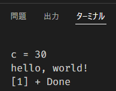
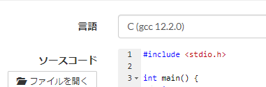

# 01 環境構築とC言語ことはじめ

## 環境構築

### dockerで環境を作る

基本はこのリポジトリをcloneすれば使えるようにしてあります。

コンテナの立ち上げの初回は5分くらい掛かりました。
dockerhubへimageを上げとくか迷ったけど面倒なのでbuildを各PCに任せます。

git cloneしてvscodeでフォルダを開いてください。
その後、F1で`Dev Containers`を入力してコンテナで開いてください。

これで環境構築が終わるはずです。

### 環境に何が入っているか？

超大雑把に言えば、GNU Compiler Collection、GCCがCで書かれたプログラムを動かすために必要なソフトになります。
G++はC++で書かれたプログラムを動かすために必要なソフトです。
どっちもとりあえず入れてあります。

[cc, gcc, g++の違い - kamocyc’s blog](https://kamocyc.hatenablog.com/entry/2020/01/23/075331)

GDBはデバッガです。遠くないうちに解説しますが、プログラムの挙動を見るのに使うソフトです。

## Cことはじめ

そこらへんに腐るほど解説本・記事はあるので、説明はあんまり深入りしないと思います。
atcoderのA問題は困らず書けるとこくらいを目指しますが、それ以外もかじります。

Cはこんな感じのコードです。

`1.c`
```C
#include <stdio.h>

int main() {
    int a = 10;
    int b = 20;
    int c = a + b;
    printf("c = %d\n", c); // c = 30

    printf("hello, world!\n"); // hello, world!

    return 0;
}

```

このプログラムは足し算して、結果を出力して、ハローワールドを出力して、終了します。

ほとんどの行の終わりにはセミコロン（`;`）を置きます。拡張子は`.c`とすることがほとんどです。

このコードを適当な名前を付けて保存し`F5`を押して実行してみてください。
（事前に設定してあるのでこれで動くようになっています）



多分こんな感じの出力が出るようになっていると思います。

"hello world"の部分を適当な文字列に変えてみて同様に実行し、出力が変化することを確かめましょう。

## 変数と型

`変数`は、数字や文字、文字列を入れておく箱のようなもの、です。
上の例で言えば、

```C
int a = 10;
```
の`a`が変数です。`printf(...)`や`return 0`は変数ではありません。

そして、`a`の前に`int`と付いています。
これが`型`です。
ある変数に入るものの性質を事前に定めておきます。
定められていないものは入りません。

つまり、
```C
int a = 10;
```
であれば、別の場所で
```C
a = 8476; // 8476という整数
```
としてもよいです。

しかし、
```C
a = 'b'; // bという文字
```
は出来なくなります。
これは、`a`という変数には`int`という整数が入る型を定めたので、文字が入らなくなるためです。

Cは「（弱い）静的型付け」という仕組みを採用しています。そのため、事前に型を定めておく必要があります。

対義語？は「動的型付け」とかになると思います。こちらは事前に型を定めなくてよいです。

[「強い型付け」「弱い型付け」って言葉を知った! – Chomado's Blog](https://chomado.com/programming/type-safety/)

型の例をいくつか示しておきます。

|型|入るもの|例|
|--|--|--|
|short|符号付き16bit整数|32767|
|int|符号付き32bit整数|-100, 2147483647|
|unsigned int|符号なし32bit整数|4294967296|
|long long int|符号付き64bit整数|9223372036854775807|
|float|単精度浮動小数点数（小数付きの数字）|10^35, 3.5547|
|double|倍精度浮動小数点数（小数付きの数字）|10^300, 58484.195451477|
|char|文字|'a', 'b', '?', '\n'|

また、入るもの側にも型があります。
例えば`0`と書けばintになりますし、`0.0`と書けばfloatかdouble、`'0'`と書けばcharになります。

### 補足

1bitは一桁の2進数であらわせる情報。`0(2)`、`1(2)`。
`11101001(2)`ならば8bitの数。

8bit（ビット） = 1byte（バイト）。1バイトが8bitを指さない場合があるので、厳密に言いたいときは1オクテットとか言ったりする、大体バイトでいい。

`浮動小数点数`は小数点が動く数のイメージ。
Cで使われているのは符号、指数部、仮数部で構成されている。
例えば、`-1943.29`を`-1 * 194329 * 10^(-2)`みたいな感じで表す。

補足終わり。

## 変数を使う

変数を使うコードを書きます。

`int main`の中に適当な変数を追加してください。

```C
int d = 999;
char mozi = '=';
```

F5で実行してエラーが出なければ成功です。

## 出力する

上で追加した変数の中身を出力してみましょう。

追加した変数の下に`printf`を追加します。
printfは文字列をターミナルに出力する`関数`です。関数は次回説明します。

```C
float suuzi = 12345.6789;
char mozi = '=';

printf("%f\n", suuzi);
printf("%c\n", mozi);
```

`\n`は改行文字です。printfは自動的に改行してくれないので自分で入れる必要があります。
試しに無しで試してもらうと挙動が分かります。

printfの1つ目の`"%d"`の部分はどういう風に変数の中身を出力するかを決めています。
`%なんとか`の部分が後ろで指定する変数で置き換えられます。

2つ目以降は出力したい変数を指定します。
```C
float suuzi2 = 12345.6789;

printf("suuzi2 = %010.2f\n", suuzi2);
```

型ごとに`%なんとか`があります。
桁数指定（10.2の部分、整数部分と小数部分）や0埋め（010の0の部分）もできます。

詳しくはググってください。
「c printf」「printf フォーマット指定子」

[フォーマット指定子一覧](https://www.k-cube.co.jp/wakaba/server/format.html)

試しに`a - b`してその結果を出力してみましょう。
出力がこんな感じになっていればよいです。
```
a - b = -10
```

## ここまでのコード例

```C
#include <stdio.h>

int main() {
    int a = 10;
    int b = 20;
    int c = a + b;
    printf("c = %d\n", c);

    printf("aaa, ああああ!\n");

    float suuzi = 12345.6789;
    char mozi = '=';

    printf("%f\n", suuzi);
    printf("%c\n", mozi);

    float suuzi2 = 12345.6789;

    printf("suuzi2 = %010.2f\n", suuzi2);

    int d = a - b;
    printf("a - b = %d\n", d);

    return 0;
}

```

先頭のincludeはライブラリというものを読み込んでいます。

printfが他の関数とまとめて入れてある辞書みたいなものを読み込んでいると思ってください。
他にも色々な辞書があります。

## 手作業の温かみ

vscodeは便利なので雑に拡張機能を入れたらコードの実行ができてしまうのですが、これを手作業でやってみたいと思います。

まず、`.out`ファイルを削除しておいてください。これが目標となる成果物だからです。

次にターミナルを開きましょう。
`...benkyoukai# `となっていれば入力し始める準備が整っています。

プログラムが書いてあるファイルを`1.c`とします。
cdコマンドでこのファイルが置いてある階層に移動してください。
lsコマンドで確かめるとよいでしょう。

ターミナルで実行していくコマンドを並べていきます。
1. `gcc -c 1.c -o 1.o`
1. `gcc 1.o -o 1.out`
1. `./1.out`

この3段階で実行ファイルができあがります。
1. ソースファイルをコンパイラ（gcc）でオブジェクトファイルにコンパイルする。
1. オブジェクトファイルをリンカ（これもgcc）でリンクして実行ファイルにする。
1. 実行ファイルを実行する。

試しにできたファイルを開いてみてください。読めないと思います。

コードそのままじゃ動いてないんだなぁということが分かってもらえればそれでOKです。

fileコマンドはそのファイルが何かを示してくれます。
それぞれこんな感じになります。

```console
# file 1.c
1.c: C source, Unicode text, UTF-8 text

# file 1.o
1.o: ELF 64-bit LSB relocatable, x86-64, version 1 (SYSV), not stripped

# file 1.out
1.out: ELF 64-bit LSB pie executable, x86-64, version 1 (SYSV), dynamically linked, interpreter /lib64/ld-linux-x86-64.so.2, BuildID[sha1]=f8654ad05c14bf9ba52b13842cd17672f30f9d2b, for GNU/Linux 3.2.0, not stripped
```

これらを、vscodeとC/C++拡張機能の力でいい感じにしています。
`.vscode/tasks.json`がF5押したときの正体です。

なので、実際は`gcc-13 -fdiagnostics-color=always -g 1.c -o 1.out`みたいなコマンドがF5の裏では実行されています。

## 入力を受け取る

ターミナルに出力するだけでなく、ターミナルから入力を受け取りたい場合があります。
こんな感じで書きます。

コード例
```c
printf("Aを入力してください。\n");
int A = 0;
scanf("%d", &A); // 入力待ちになる、打ち終わったらEnter

printf("A = %d\n", A);

float B = 0;
char C = 0;
printf("BとCを半角スペースで区切って入力してください。\n");
scanf("%f %c", &B, &C); // 入力待ちになる、半角スペース開けて入力

printf("B = %f, C = %c\n", B, C);
```

出力例
```
Aを入力してください。
54
A = 54
BとCを半角スペースで区切って入力してください。
15.1111111 (
B = 15.111111, C = (
```

scanfが入力を受け取る関数です。

1つ目はprintfと同じようなフォーマット指定子が来ます。

2つ目以降で受け取った値を入れる変数を指定しますが、その時変数名の前に`&`を置きます。
これはポインタという概念の話になるので明日以降にします。
今はおまじないです。

これで入力を受け取れます。

## 条件分岐

計算結果がプラスとマイナスで処理を変えたい！という場合があったりします。
こんな感じに書きます。

```c
int a = 100;

int b = 200;
int c = 50; 

if(a - b >= 0){ // a-b = -100
    puts("a - bは正です。");
}else{
    puts("a - bは負です。");
}

if(a - c >= 0){ // a-c = 50
    puts("a - cは正です。");
}else{
    puts("a - cは負です。");
}
```

```
a - bは負です。
a - cは正です。
```

変数の数字を変えて実行してみてください。

if文という構文です。
```c
if(条件式){
    条件式が正しいときの処理
}else{
    条件式が正しくない時の処理
}
```

こう書くこともできます。
```c
if(条件式1){
    条件式1が正しいときの処理
}else if(条件式2){
    条件式2が正しいときの処理
}else{
    条件式1・2どっちも正しくない時の処理
}
```

条件式が正しいことを真(true)、正しくないことを偽(false)と言ったりします。

また、数字は0のみ偽、それ以外（-1や100）は真になります。

条件式は`>, <, >=, <=`、`!`（条件を反転）、`&&`（論理積）、`||`（論理和）などを使って書かれます。

- `a || b`は`a`または`b`が真ならば真。
- `a && b`は`a`が真かつ`b`が真ならば真。

例えば、`a = 10, b = 20, c = 30`なら
- `6` は
- `0` は
- `59 - 10 < 84` は
- `a > b` は
- `(29*a) > 440` は
- `!a && b && 20<c` は
- `!(a > c) && (b || c)` は

## 演習or課題

これでatcoderの問題が一部解けるようになります。

[A - Calc](https://atcoder.jp/contests/abc172/tasks/abc172_a)

とりあえずこれを解きましょう。

書けたらこんな感じで言語を選択し提出を押します。




下は課題です。時間余ってればやってもよいです。

[A - Multiplication 1](https://atcoder.jp/contests/abc169/tasks/abc169_a)

[A - 9x9](https://atcoder.jp/contests/abc144/tasks/abc144_a)

[A - +-x](https://atcoder.jp/contests/abc137/tasks/abc137_a)

[A - Apple Pie](https://atcoder.jp/contests/abc128/tasks/abc128_a)
