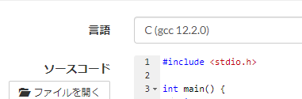

# 02 制御文と関数

if文、switch文、for文などがあります。

今までは上から1行ずつ処理をしていました。

制御文でプログラムの流れを変えます。

## 条件分岐

計算結果がプラスとマイナスで処理を変えたい！という場合があったりします。
こんな感じに書きます。

`> =`　`>=`

`puts`は文字列（""で囲ってあるやつ）を改行付けて出力する関数。
変数を出力できなかったはずです。

```c
int a = 100;

int b = 200;
int c = 50; 

if(a - b >= 0){ // a-b = -100
    puts("a - bは正です。");
}else{
    puts("a - bは負です。");
}

if(a - c >= 0){ // a-c = 50
    puts("a - cは正です。");
}else{
    puts("a - cは負です。");
}
```

```
a - bは負です。
a - cは正です。
```

変数の数字を変えて実行してみてください。

if文という構文です。
```c
if(条件式){
    条件式が正しいときの処理
}

if(条件式){
    条件式が正しいときの処理
}else{
    条件式が正しくない時の処理
}
```

こう書くこともできます。
```c
if(条件式1){
    条件式1が正しいときの処理
}else if(条件式2){
    条件式2が正しいときの処理
}else{
    条件式1・2どっちも正しくない時の処理
}
```

条件式が正しいことを真（しん）(true)、正しくないことを偽（ぎ）(false)と言ったりします。

また、条件式の結果が数字は0のみ偽、それ以外（-1や100）は真になります。文字や文字列は真になります。

条件式は`>, <, >=, <=`、`!`（条件を反転）、`&&`（論理積）、`||`（論理和）などを使って書かれます。

- `a || b`は`a`または`b`が真ならば真。
- `a && b`は`a`が真かつ`b`が真ならば真。

例えば、`a = 10, b = 20, c = 30`なら
- `6` は
- `0` は
- `59 - 10 < 84` は
- `a > b` は
- `(29*a) > 440` は
- `!a && b && 20<c` は`((!a) && b) && (20<c)`
- `!(a > c) && (b || c)` は

## 演習or課題

これでatcoderの問題が一部解けるようになります。

[A - Calc](https://atcoder.jp/contests/abc172/tasks/abc172_a)

とりあえずこれを解きましょう。

階乗は`^`ではありません！地道に`a*a*a`などとしましょう。

`inclede`などの行も必要です。

出力例と一言一句違わない出力が必要です。

制約に書かれていない入力は心配しなくていいです。

スペース区切りの入力は`scanf("%d %d", &hoge, &huga)`みたいにすれば受け取れます。

書けたらこんな感じで言語を選択し提出を押します。




下は課題です。時間余ってればやってもよいです。

[A - Multiplication 1](https://atcoder.jp/contests/abc169/tasks/abc169_a)

[A - 9x9](https://atcoder.jp/contests/abc144/tasks/abc144_a)

[A - +-x](https://atcoder.jp/contests/abc137/tasks/abc137_a)

[A - Apple Pie](https://atcoder.jp/contests/abc128/tasks/abc128_a)


## switch文

if文でつなげるのが面倒な条件を書く場合があります。

例えば、
```c
int m = 39475;
switch (m % 3) {
case 0:
    puts("割り切れます。");
    break;
case 1:
case 2:
    puts("割り切れません。");
    break;

default:
    break;
}
```

mが式で、この計算結果に応じて各case文へ飛びます。

break文が無いと、そのまま次の行へ進んでしまいます。
また、default文はどのcaseにも当てはまらない時に進みます。

mを変えたり、case 0のbreakを消したりして挙動が変わることを確かめてください。

## for文、while文、do-while文

同じ処理を繰り返したい場合があります。

以下はどれも同じ挙動をします。
```c
int i = 0;
int cnt = 3;
puts("for");
for (i = 0; i < cnt; i++) { // (初期化; 真ならば回り続ける条件; 1回処理が終わったらする処理)
    printf("i = %2d\n", i);
}

puts("while");
i = 0;
while (i < cnt) { // (真ならば回り続ける条件)
    printf("i = %2d\n", i);
    i++;
}

i = 0;
puts("do-while");
do { // 処理
    printf("i = %2d\n", i);
    i++;
} while (i < cnt); // (真ならば回り続ける条件)
```

条件を`<=`に変えたり、`i++`の位置を変えたりして挙動が変わることを確認してください。

条件によっては無限ループに陥ってしまいます。
無限ループに入ったらターミナルをクリックして`Ctrl+C`で実行を止めましょう。

### 補足 ++とか

`i++`、`i--`は値を評価した後で1をiに足し引きする。
`++i`、`--i`なら評価する前に処理する。
```c
i = 0;
i = i++ + 1;
printf("i = %2d\n", i);

i = 0;
i = ++i + 1;
printf("i = %2d\n", i);
```
これらは別の値になる。

補足終わり。

## 問題

入力を受け取れて出力できるようになるために必要な問題をやってからあっとこします。

### 1

入力
```
1 2 3 4 5
```
を配列に受け取って、入力と同様に出力してください。

### 2

入力
```
N
1 2 3 ... N
```
に対して、Nを受け取ってから次の行の1～Nを配列に格納して、1～Nを1行ずつ出力してください。

N=3のとき
入力が
```
3
1 2 3
```

```
1
2
3
```
となればよいです。

### 3

制御文を使うためにfizz-buzz問題を解きます。

1から100まで順に数えていき、3でのみ割り切れるときはfizz、5でのみ割り切れるときはbuzz、3でも5でも割り切れるときはfizzbuzzと1行ずつ出力してください。

```
1
2
fizz
4
buzz
fizz
7
8
fizz
buzz
11
fizz
13
14
fizzbuzz
```
というようになっていればよいです。

### あっとこ

これで多分問題が解けます。

いくつか貼っておきます。

多分体感上から下にかけて難しくなっていくと思います。

Papers, Pleaseまでを課題とします。

[B - 81](https://atcoder.jp/contests/abc144/tasks/abc144_b)

[B - FizzBuzz Sum](https://atcoder.jp/contests/abc162/tasks/abc162_b)

[B - Remove It](https://atcoder.jp/contests/abc191/tasks/abc191_b)

[B - Papers, Please](https://atcoder.jp/contests/abc155/tasks/abc155_b)

[B - Achieve the Goal](https://atcoder.jp/contests/abc151/tasks/abc151_b)

## 関数
