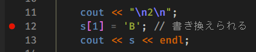
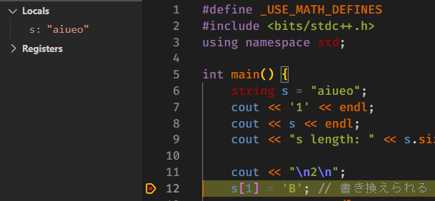

# 04 C++

## はじめに

[C++入門 AtCoder Programming Guide for beginners (APG4b) - AtCoder](https://atcoder.jp/contests/apg4b)をやりましょう

この辺りを読むと参考になると思います。

- [C++ - Wikipedia](https://ja.wikipedia.org/wiki/C%2B%2B#:~:text=C%2B%2B%EF%BC%88%E3%82%B7%E3%83%BC%E3%83%97%E3%83%A9%E3%82%B9%E3%83%97%E3%83%A9%E3%82%B9,%E3%81%8C%E7%B5%84%E3%81%BF%E5%90%88%E3%82%8F%E3%81%95%E3%82%8C%E3%81%A6%E3%81%84%E3%82%8B%E3%80%82)
- [江添亮の入門C++ | 江添亮のC++入門](https://cpp.rainy.me/)
- [C 言語経験者のための C++ 入門](https://kanamori.cs.tsukuba.ac.jp/docs/cpp_introduction.pdf)
- [ゼロから学ぶ C++](https://rinatz.github.io/cpp-book/)
- [C++ へようこそ - Modern C++ | Microsoft Learn](https://learn.microsoft.com/ja-jp/cpp/cpp/welcome-back-to-cpp-modern-cpp?view=msvc-170)

また、ざっと標準ライブラリや言語仕様を確認する分にはここが見やすいと思っています。
- [cpprefjp - C++日本語リファレンス](https://cpprefjp.github.io/)


さらに、atcoder problemsの使い方がわからーんという話があったので、一応貼っておきます。
- [AtCoder Problemsの使い方（AtCoder Problemsを知らない人向け） - ntk log ntk](https://ntk-ta01.hatenablog.com/entry/2020/04/15/001405)

## 入出力と変数

### ひとまず入出力

Cと比べるとめっちゃ簡単になります。

```cpp
#define _USE_MATH_DEFINES // 数学定数を使うために必要
#include <bits/stdc++.h>  // gcc拡張で全てのライブラリを読み込む
using namespace std;      // 名前空間としてstdを使用する、std::を省略できる

int main() {
    cout << "Hello, world!" << endl;
}
```

std::coutに`<<`で文字列を投げ込み、一番後ろにstd::endlを書けば改行されます。

`"Hello, world\n"`としてもよいです。この場合、endlは要りません。

`using namespace std;`と`std::`の話をするには名前空間について説明する必要がありますが、長いので省略します。
[名前 | 江添亮のC++入門](https://cpp.rainy.me/013-names.html#%E5%90%8D%E5%89%8D%E7%A9%BA%E9%96%93)あたりに書いてあります。
本来ならばcoutやendlに`std::`を付ける必要があるんだなぁと覚えておいてください。
以下では`std::`が省略されていることがほとんどです。

`#`から始まるプリプロセッサ指令や、`//`から始まるコメントなどを除き、各行の最後には`;`（セミコロン）が必要です。

また、CのコードはほぼそのままC++のコードとして動きます。
ライブラリ周りなどを調節する必要があります。

拡張子は`.cpp`がよく使われます。

入力も簡単です。

```cpp
#define _USE_MATH_DEFINES
#include <bits/stdc++.h>
using namespace std;

int main() {
    int a, b;
    cin >> a >> b;
    cout << "a: " << a << "\nb: " << b << endl;
}
```

cinから`>>`で変数に入れるだけでいい感じに動きます。
Cのscanf的なことをしてくれます。

出力時の0埋めや桁数指定などは少し面倒です。
printfがそのまま使えるのでそれでもかまいません。
ここを参考にしてください。
[【C++】小数点の桁数を指定する方法と注意点【cout／iostream】 | MaryCore](https://marycore.jp/prog/cpp/stream-format-float/)

### 変数

Cに比べて型がいっぱい増えました。
特に`vector`と`string`が便利な機能をたくさん持っていて、よく使います。

```cpp
#define _USE_MATH_DEFINES
#include <bits/stdc++.h>
using namespace std;

int main() {
    // 組み込み型、基礎的な型のこと
    long long int a;
    char b;
    int arr[100] = {};
    // 便利な機能がある型（クラス）
    string s;                     // 空の文字列
    vector<long long int> v(100); // long long int型で100個の要素を持つvector ~= 配列
    list<int> c(50);              // int型で50個の要素を持つlist
    queue<char> q;                // char型のqueue
    deque<short> deq;             // short型のdouble-ended queue(deque)
                                  // 他にもたくさんある
}
```

便利な型として並べてあるものはクラスと呼ばれ、組み込み型より便利な機能が追加されています。

その1つとして、`<int>`のような部分があります。
これは、クラスを`<>`内の型が使えるようにする、といったような意味で、型でもクラスでも入ります。
例えば、`vector<string>`という型を考えることができ、これは、文字列の配列になります。

stringは便利な操作ができる文字列です。

vectorは可変長配列です。

listはリストと呼ばれる構造で、配列とは区別されて使われます。

queue（キュー）は先入れ先出しのキューです。
列に並んだ人を前から順に接客していくような構造です。

deque（デック、double-ended queue）は両端から出し入れできるキューです。
畳んだタオルを上から積み重ね、上から使っていくようなデータ構造のスタックとしても使えます。

vectorを使ってみます。
```cpp
#define _USE_MATH_DEFINES
#include <bits/stdc++.h>
using namespace std;

int main() {
    int n = 100;
    int p_arr[100] = {};
    vector<int> v_arr(n);

    for (int i = 0; i < n; i++) {
        p_arr[i] = i;
        v_arr[i] = i;
        v_arr.at(i) = i; // これでもアクセスできる
    }

    cout << "1" << endl;
    cout << "p_arr length: " << sizeof(p_arr) / sizeof(p_arr[0]) << endl;
    cout << "v_arr length: " << v_arr.size() << endl; // 長さの取得はこれでOK

    // p_arr[n] = 101;    // これは確保していない所に書き込んでしまったりする、危険！
    // v_arr[n] = 101;    // これは確保していない所に書き込んでしまったりする、危険！
    // v_arr.at(n) = 101; // atなら確認して領域外ならエラーで落ちてくれる、安全

    cout << "\n2\n";
    cout << "v_arr's very back: " << v_arr[v_arr.size() - 1] << endl;
    v_arr.push_back(1001); // 一番後ろに追加できる
    cout << "v_arr's very back: " << v_arr[v_arr.size() - 1] << endl;

    cout << "\n3\n";
    cout << "v_arr's very back: " << v_arr[v_arr.size() - 1] << endl;
    v_arr.pop_back(); // 一番後ろを削除もできる
    cout << "v_arr's very back: " << v_arr[v_arr.size() - 1] << endl;
}
```

vectorとして宣言された変数は、`.`（ドット）でアクセスできるメンバ関数やメンバ変数が付いてきます。
メンバ関数は、その元の変数を操作する関数です。

stringも軽く触っておきましょう。
`vector<char>`を考えることもできますが、恐らくstringの方が使いやすいです。
```cpp
#define _USE_MATH_DEFINES
#include <bits/stdc++.h>
using namespace std;

int main() {
    string s = "aiueo";
    cout << '1' << endl;
    cout << s << endl;
    cout << "s length: " << s.size() << endl;

    cout << "\n2\n";
    s[1] = 'B'; // 書き換えられる
    cout << s << endl;

    cout << "\n3\n";
    s += " test"; // 文字列の連結ができる
    cout << s << endl;
    s.push_back('T'); // push_backは文字だけ
    cout << s << endl;
}
```

試しに`vector<string>`で以下のデータを受け取って1行ずつ出力してみましょう。

入力の数と入力される文字列が与えられます。
```
5
ab cccc deeee fffff g
```

このように出力されればOKです。
```
ab
cccc
deeee
fffff
g
```

push_backしてもよいですが、要素数が分かっているときは宣言時に初期化しておくと速いことが多いです。

## 問題を解く前に

ちょっとだけデバッガという便利機能の話をします。

gdbはデバッガですが、何ができるかといえば、バグ探しに使えます。

F5を押したときに走っているのは実はコンパイラとプログラムだけではなくデバッガも走っていました。

### ブレークポイント

コードの行番号の左にカーソルを持っていくと、赤いぽっちが出てきます。

クリックすると、固定され、もう一度クリックすると外れます。



これはブレークポイントといい、F5キーでコードを実行した際に、この行で一時停止させることができます。

その際には、変数に何が入っているかなどが分かります。



複数行に置くこともできます。

### 一時停止時の操作

F5を押して一時停止すると上にこのボタンが現れます。


左から、続行、ステップオーバー、ステップイン、ステップアウト、再起動、停止です。

続行は、次のブレイクポイントまでコードを進めます。

ステップオーバーは1行ずつ進めます。

ステップインは、関数などの行に居れば、その関数の中へ進みます。

ステップアウトは関数などから出ます。

再起動はプログラムを再起動し、停止は実行をやめます。

### 左の画面

デバッガが起動すると左で実行とデバッグが開きます。


変数はその時点での変数の中身を見ることができます。

ウォッチ式は、変数や式を、その時点での値を使い計算した値を表示してくれます。
自由に編集できます。

コールスタックは今どの関数の何行目で何のために実行が一時停止しているかが表示されます。
関数の中で止めて、呼び出し元の関数を見るのに使えます。

## 問題を解く

if文、for文あたりは追加機能もありますが、Cでやった書き方がそのまま使えます。

簡単な文字列操作もできるようになったので、解ける問題の幅が広がりました。

ので、様々な問題を解いてみましょう。

時間内で解説する問題と、課題にする問題を挙げておきます。

### 時間内用

入出力に慣れましょう。
- [A - AC or WA](https://atcoder.jp/contests/abc152/tasks/abc152_a)
- [A - Red or Not](https://atcoder.jp/contests/abc138/tasks/abc138_a)

文字列処理です。
- [B - Multiple of 9](https://atcoder.jp/contests/abc176/tasks/abc176_b)
- [B - Tap Dance](https://atcoder.jp/contests/abc141/tasks/abc141_b)

### 課題用

簡単
- [A - ∴ (Therefore)](https://atcoder.jp/contests/abc168/tasks/abc168_a)
- [A - Tires](https://atcoder.jp/contests/abc224/tasks/abc224_a)

ちょっと難しい
- [B - ... (Triple Dots)](https://atcoder.jp/contests/abc168/tasks/abc168_b)
- [B - typo](https://atcoder.jp/contests/abc221/tasks/abc221_b)
- [B - Judge Status Summary](https://atcoder.jp/contests/abc173/tasks/abc173_b)

ここから下は課題にしません。

ちょっと難しそう、何とかして欲しい関数を探してみてください
- [B - Uneven Numbers](https://atcoder.jp/contests/abc136/tasks/abc136_b)

実装に苦しみそう、`vector<vector<string>>`を使ってみてください
- [A - First Grid](https://atcoder.jp/contests/abc229/tasks/abc229_a)

かなり実装に苦しみそう
- [B - Visibility](https://atcoder.jp/contests/abc197/tasks/abc197_b)
